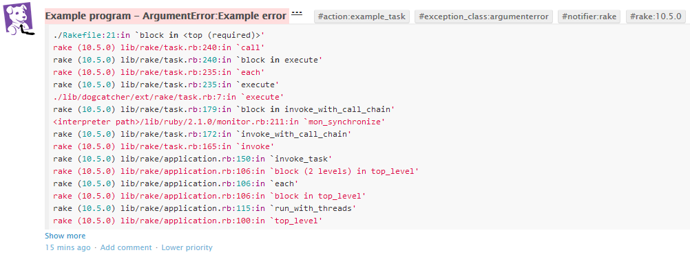

# Dogcatcher

[](https://travis-ci.org/zl4bv/dogcatcher)
[](https://badge.fury.io/rb/dogcatcher)



Dogcatcher is a tool to track exceptions in Ruby applications and send them to Datadog

## Installation

Add this line to your application's Gemfile:

```ruby
gem 'dogcatcher'
```

And then execute:

    $ bundle

Or install it yourself as:

    $ gem install dogcatcher

## Usage

### Basic example

This is an example that you can use anywhere within your Ruby project. By
default the exception will be sent to statsd running on the local host.

```ruby
require 'dogcatcher'

begin
  fail ArgumentError, 'Example error'
rescue ArgumentError => exception
  Dogcatcher.notify(exception)
  raise exception
end
```

### Example within Rake

When dogcatcher has been required in a Rakefile, the all exceptions raised in
any Rake task will automatically be collected.

```ruby
require 'dogcatcher'

task :example_task do
  fail ArgumentError, 'Example error'
end
```

## Configuration

By default Dogcatcher will send metric and event data to statsd running on the
local host. By specifying a Datadog API key, Dogcatcher will switch to sending
events to the Datadog API instead.

```ruby
Dogcatcher.configure do |c|
  c.api_key = '<datadog API key goes here>'
end
```

Since the default approach is to send data to one or the other, options are
available to explicitly control where the data is sent.

```ruby
Dogcatcher.configure do |c|
  c.use_dogapi = true
  c.use_statsd = true
end
```

By default Dogcatcher will send both metrics and events, but these can be
disabled individually.

```ruby
Dogcatcher.configure do |c|
  c.send_metric = false
  c.send_event = false
end
```

Metrics will be sent with a default name of `dogcatcher.errors.count`, this can
be customized by setting the `metric_name` configurable.

```ruby
Dogcatcher.configure do |c|
  c.metric_name = 'my_app.errors.count'
end
```

The host and port that statsd data is sent to can be configured like so.

```ruby
Dogcatcher.configure do |c|
  c.statsd_host = '127.0.0.1'
  c.statsd_port = 8125
end
```

An optional program name can be specified to help distinguish between multiple
applications. This will appear in the event title and as a tag on the metric.

```ruby
Dogcatcher.configure do |c|
  c.program = 'Example program'
end
```

By default, Dogcatcher will add tags for each gem and its version found in the
backtrace. This can be disabled if required.

```ruby
Dogcatcher.configure do |c|
  c.gem_tags = false
end
```

The backtrace can be cleaned by adding filters or silencers. The filters
shown below were used to generate the screenshot shown above.

```ruby
Dogcatcher.configure do |c|
  c.add_filter { |line| line.gsub(Dir.pwd, '.') }
  c.add_filter { |line| line.gsub(%r{^.*/gem/ruby/[0-9.]+/gems/([A-Za-z0-9\-_]+)-([0-9.]+(\.[a-z]+(\.[0-9]+)?)?)/}, '\1 (\2) ') }
  c.add_filter { |line| line.gsub(%r{.*/gem/ruby/[0-9.]+(/bin/)}, '<gem path>\1') }
  c.add_filter { |line| line.gsub(%r{.*(/lib/ruby/[0-9.]+)}, '<interpreter path>\1') }
  c.add_silencer { |line| false }
end
```

Custom tags can be sent with exception data by adding them to the config.

```ruby
Dogcatcher.configure do |c|
  c.custom_tags = ['key1:value1']
  c.custom_tags << 'key2:value2'
end
```

## Contributing

Bug reports and pull requests are welcome on GitHub at https://github.com/zl4bv/dogcatcher.

## License

The gem is available as open source under the terms of the [MIT License](http://opensource.org/licenses/MIT).
